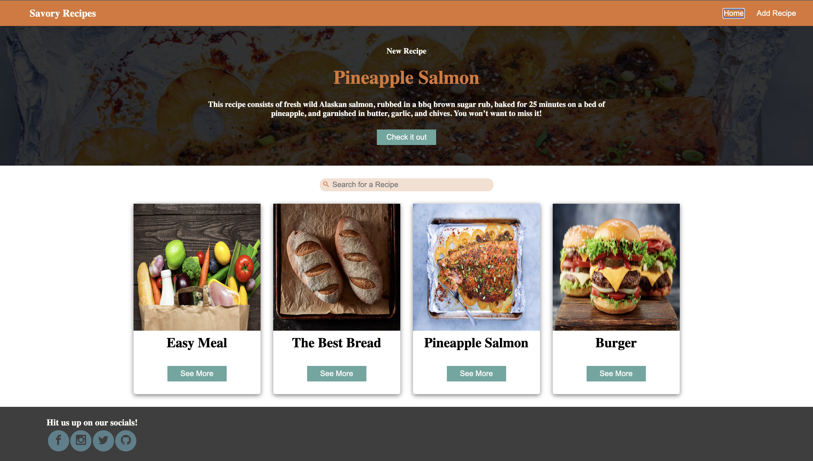
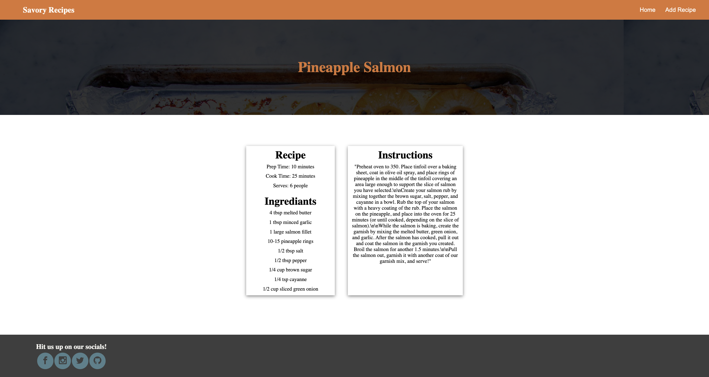
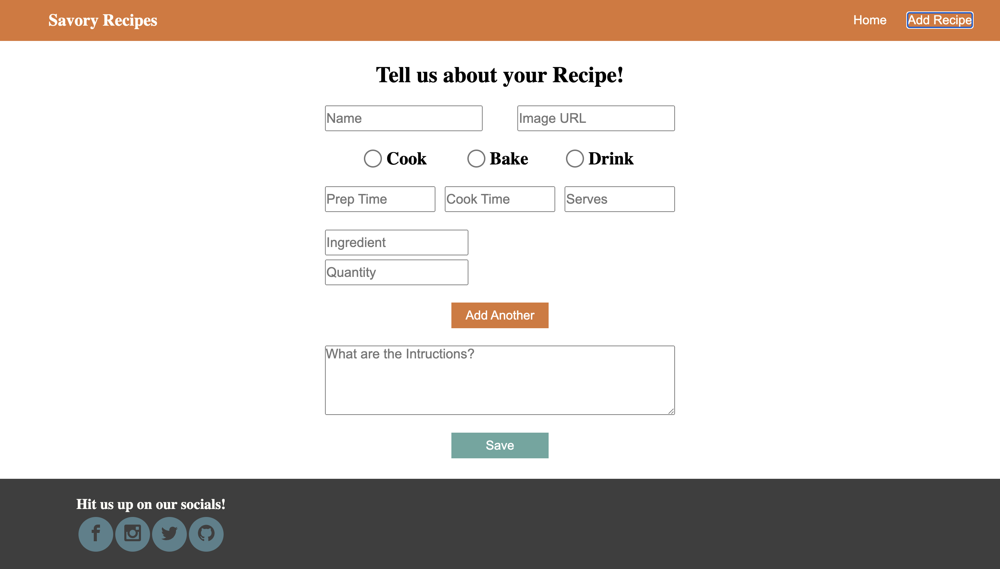

## Recipe App
This is a Front End focused application that allows users to create and view recipes.

## Technologies Used
- Javascript
- React
- HTML
- CSS
- Formik

## Home Page

The home page has a featured recipe at the top of the page. This is also where all of the recipes are listed. There is a search bar that lets you search for a recipe. To view the details of a recipe, click on the "See More" button.

## Recipe Details Page

The recipe details page shows information about the recipe like prep time, cook time, servings, ingredients needed, and the intructions to make the recipe.

## Add Recipe Page

The add recipe page allows you to add a recipe with an image and details like recipe name, prep time, cook time, servings, ingredients needed, and the intructions to make the recipe.